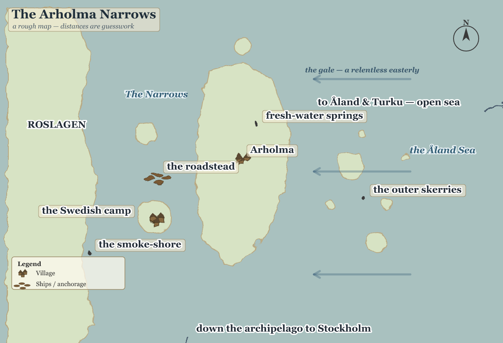
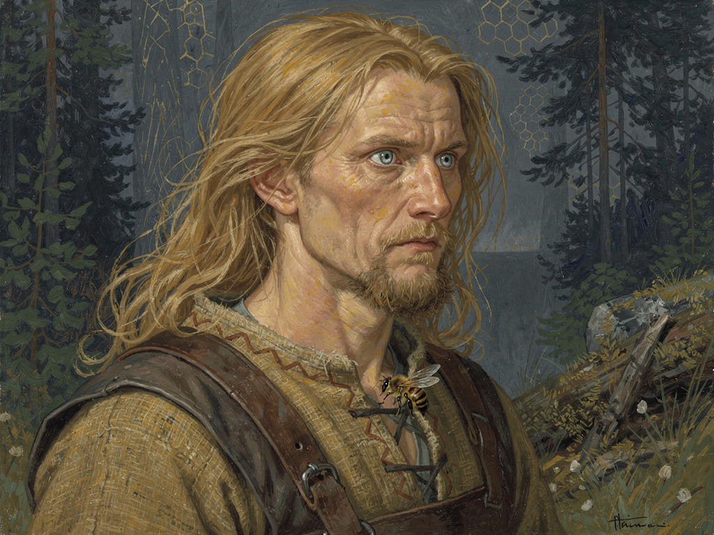
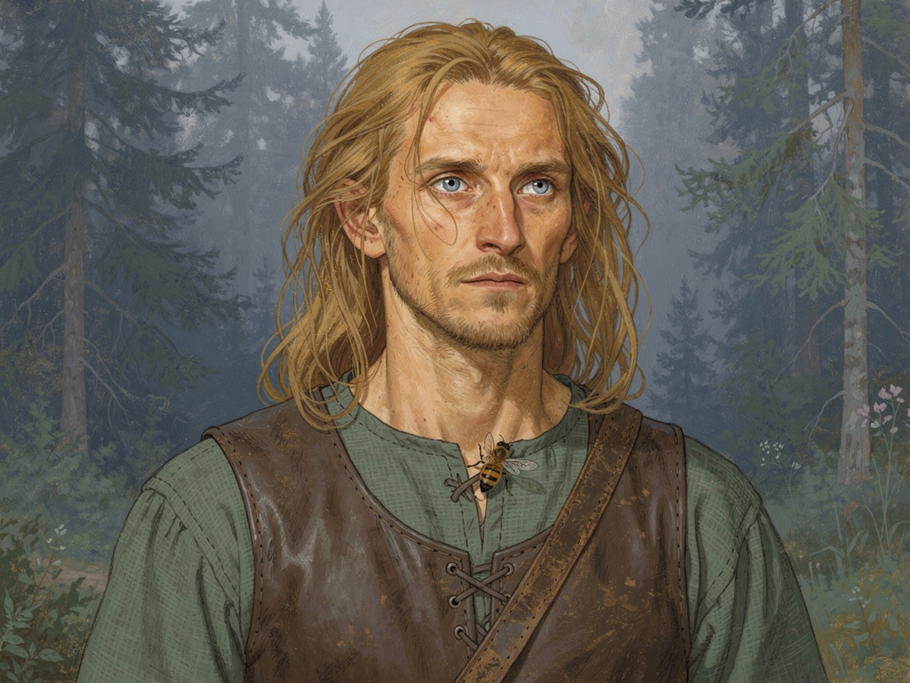
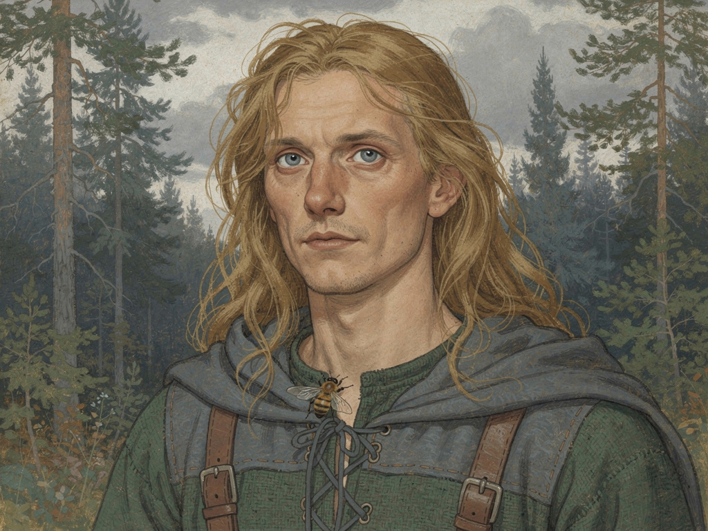

# Maps

*The Year 1220 — the founding year*

#### Arholma Orient K3

#### Caducus Grounds

#### Caducus Site Painted

#### Caducus Site Public

#### Char-054 Portrait A1

#### Char-054 Portrait A2

#### Char-054 Portrait A3

